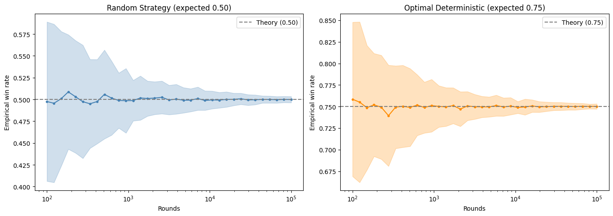
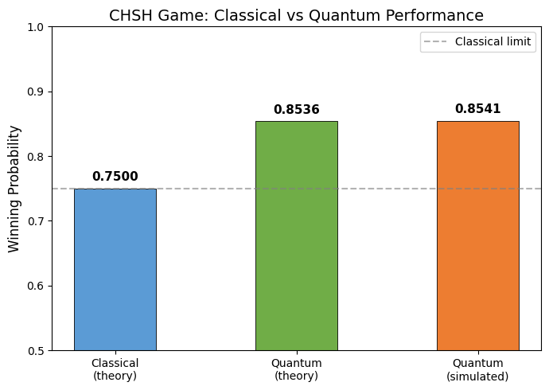
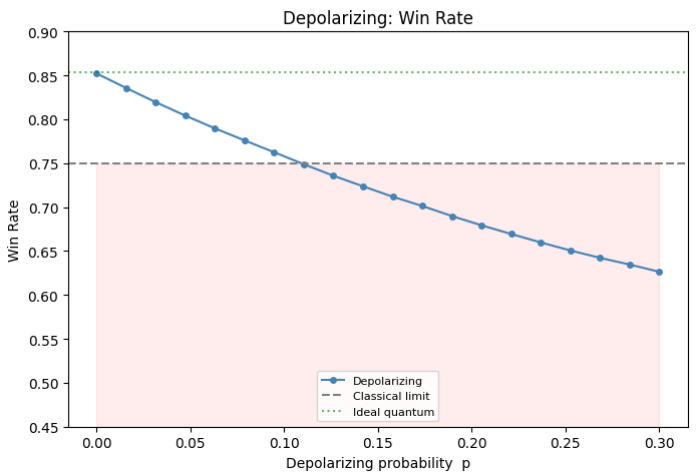

# CHSH Game: Quantum Advantage and Noise Analysis

A computational study of the **CHSH nonlocal game**, one of the most important protocols in quantum information theory.  
This project compares classical and quantum strategies, reproduces Bell inequality violation numerically, and studies how noise reduces the quantum advantage.

## Overview

The CHSH game is a two-player cooperative game that highlights the difference between **classical correlations** and **quantum entanglement**.

Classically, the maximum winning probability is **0.75**.

Quantum mechanically, with an optimal entangled strategy, the maximum winning probability is **cos²(π/8) ≈ 0.8536**.

This notebook verifies both results computationally and explores how the advantage changes under realistic noise.

## What this project does

- Explains the CHSH game and its significance
- Enumerates all deterministic classical strategies
- Verifies the classical maximum win rate of **75%**
- Implements the optimal **quantum CHSH strategy** with entangled qubits
- Computes:
  - empirical winning probability
  - CHSH correlators
  - the **S parameter**
- Compares results against:
  - Classical bound: **|S| ≤ 2**
  - Tsirelson bound: **|S| ≤ 2√2**
- Studies robustness under noise, including:
  - **Depolarizing noise**
  - **Readout noise**
- Uses repeated runs and statistical analysis for stability

## Main Results

### 1. Convergence of Classical Strategies

The simulation verifies that empirical win rates converge to the expected theoretical values as the number of rounds increases.  
A random classical strategy converges to **0.50**, while the optimal deterministic classical strategy converges to **0.75**.

### 2. Classical vs Quantum Performance

The notebook reproduces the gap between the classical CHSH limit and the optimal quantum strategy.  
The simulated quantum strategy closely matches the theoretical quantum maximum.

### 3. Effect of Depolarizing Noise

The project studies how depolarizing noise degrades the quantum advantage.  
As the depolarizing probability increases, the quantum win rate decreases and eventually falls below the classical limit.

## Key outcomes

- Confirms the classical CHSH limit of **0.75**
- Reproduces the optimal quantum advantage of about **0.8536**
- Demonstrates Bell inequality violation through simulation
- Shows how noise progressively reduces the winning probability and the CHSH violation

## Tools and libraries

- Python
- Qiskit
- Qiskit Aer
- NumPy
- Pandas
- Matplotlib
